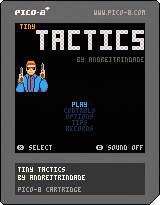

# tiny_tactics
 

 
 
 

 A turn-based, tactics / puzzle game for PICO-8

## How to play
 You can play the game online at the [Lexaloffle BBS](https://www.lexaloffle.com/bbs/?tid=55172).

 You can also download the [latest release](releases) and play offline.
 
## Postmortem
 I wrote an extensive [postmortem](https://www.lexaloffle.com/bbs/?tid=55244) detailing my experience making the game over the last three months.
 
## PICO-8
 If you want to know more about PICO-8, check the [PICO-8 landing page](https://www.lexaloffle.com/pico-8.php) or its [FAQ](https://www.lexaloffle.com/pico-8.php?page=faq).
 
## Pull requests
 This project is mostly done and uses over 99% of the available tokens / compressed size limit for a PICO-8 cart. Therefore, I'm not accepting pull requests for this one.
 
## Files and Folders
 - **tiny_tactics.p8**: PICO-8 source is a single, plain text file, containing graphics, sound and code (which, in this case, merely includes some lua files from the folder below).
 - **inc**: the lua files included in the .p8 file. The project was structured like this so that the code was better organized and editable in an external editor, outside PICO-8. Lua files were creted in Notepad++.
 - **exports**
   - **cart/tiny_tactics.p8.png**: image with the compressed cartridge embedded into it, playable in PICO-8. This is what you get if you download the cart from the Lexaloffle BBS.
   - **html**: standalone HTML version.
   - **bynary apps**: executable versions for Windows, Mac, Linux and Raspberry Pi. I only tested the Windows *.exe*, but all of them should work.
   - **map and sprites**: useful for reviewing level layouts, for example.
 - **screenshots_gifs**: screenshots and GIFs (recorded in PICO-8) used when posting on the *Lexaloffle BBS*.
 - **test_cdata**: save file used for testing the alternative skin reward.
 - **walkthrough**: GIFs (recored in PICO-8) showing how to get the *dev's record* in each level.
 - **leaderboards**: GIFs (recored in PICO-8) showing  how to get the gold trophies that I'm aware are possible. First person to claim the record gets the credit (once I can verify the record is really achievable, of course).
 
## Cartridge Data
 This is how PICO-8 persists your progress.
 - If you are using PICO-8 or a binary app, your progress is saved in a text file. In Windows, for example, this file is created in the following folder (by default):
`C:\Users\[username]\AppData\Roaming\pico-8\cdata\`
 - If you are playing on a browser (either online or using the standalone HTML version), data is saved on the browser's client-side storage.
 
## Notes
 - This project was uploaded to GitHub when it was almost done, so do not expect much from commit history.
